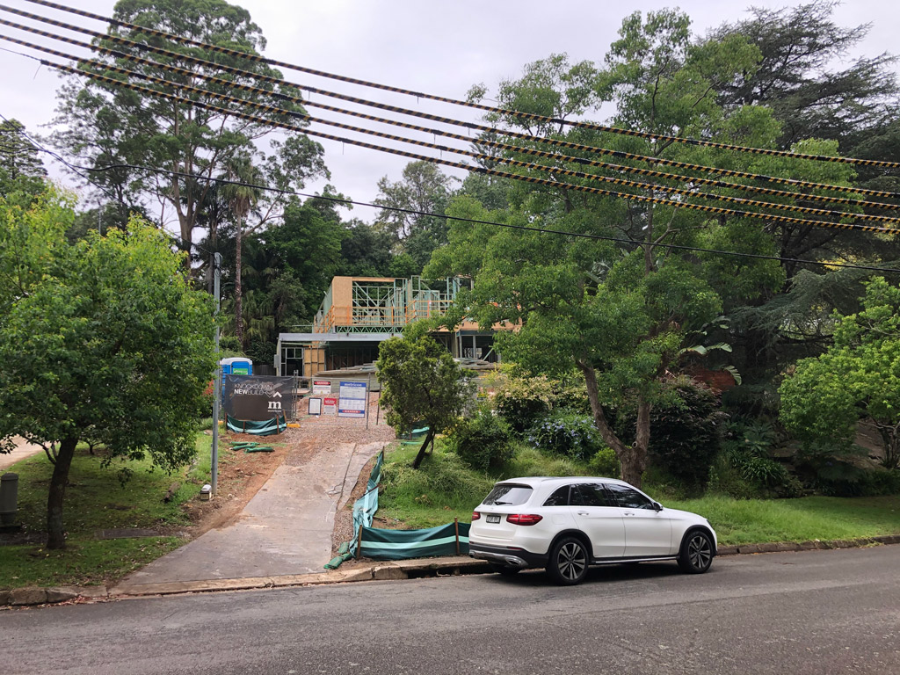
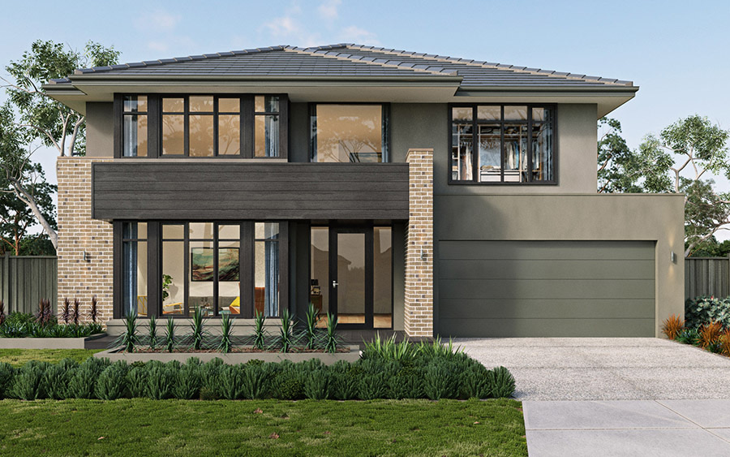

# Landscape Homework

This document is created for Lone Pine Landscapes for showing what we like. Lone Pine can refer to those inspiration images for design ideas. We took photos from open inspections in upper north shore or googled. 

Please use this document for reference only. Landscape designer should feel free to input any ideas based on his own experiences and professionals.

### Table of Contents
1. [Backyard](#Backyard)
2. [East side](#East-side)
3. [West side](#West-side)
4. [Frontyard](#Frontyard)

## Backyard

- Pool or infinite pool 

- In-Ground with ret wall surrounded

- Timber steps connecting to pegola deck

- Lawn area with few steps up

- rendered retention wall or sand stone

- Dense hedge
Neighbour at rear of the lot asking for her privacy. If we removed the existing tree at rear of the lot, we could put some dense hedge, for example:

## East side
- Pergola and deck attached Sitting room
This feature can be optional and leave as future build for budget reason.

## West side
the narrow side

- some green leaf on the fence
Because we can see through from kitchen and pantry glass. We wanna some low maintain plants there. Ground surface prefer sealed by concrete.  

## Frontyard
- Prefer a flat lawn block with ret wall at each end. It would be nice to have a big flat terrace on front yard.

- Existing plants in frontyard slope are still nice but need to mulch, trim and cleanup. Photo taken at year 2015 when we first bought the property

Current status of the front yard, view from street

- The Metricon Hampshire lodge facade
This is the facade we chosen, a contemporary and lodge feel facade, which we think harmonized to the surrounding leafy street feel

- Front yerd stair cases.
Prefer stair cases from the boundry lot. If for the budget reason, stair could start from the end of driveway.

